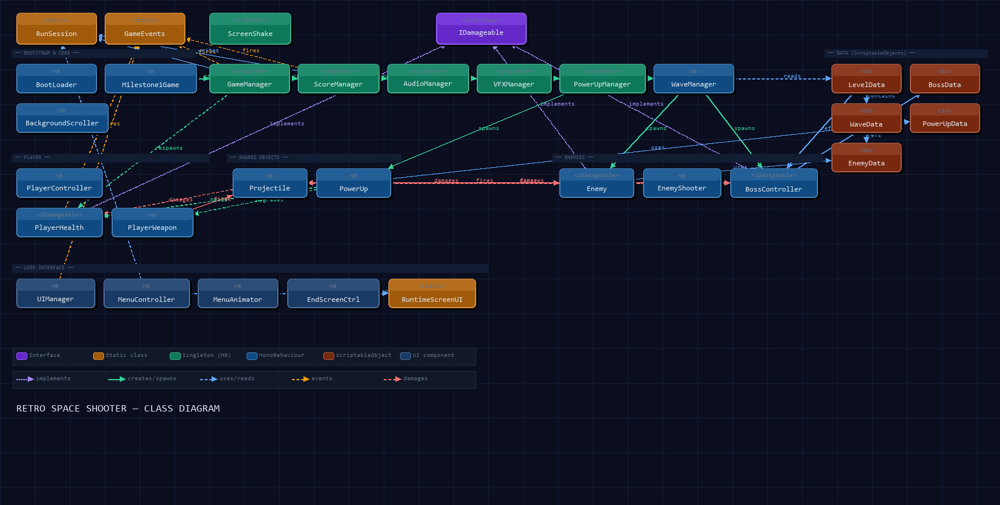

# Retro Space Shooter

Vertical 2D arcade shooter built with Unity 6, URP 2D, Rigidbody2D and the
Unity Input System.

## Class diagram

> **Key patterns**
> - `IDamageable` — single interface implemented by `PlayerHealth`, `Enemy` and `BossController`; all damage flows through `TakeDamage(int)`.
> - `GameEvents` (static) — thin event bus; producers (`ScoreManager`, `PlayerHealth`, `GameManager`) raise events; `UIManager` consumes them.
> - `RunSession` (static) — carries score, lives and multiplier across scene loads without `DontDestroyOnLoad`.
> - Data-driven — every enemy, boss, wave and level is a `ScriptableObject`; tune values without touching scripts.
> - Singletons with `Instance` — `GameManager`, `ScoreManager`, `AudioManager`, `VFXManager`, `PowerUpManager`, `ScreenShake`.

## Script architecture

| Layer | Classes | Responsibility |
|---|---|---|
| **Interfaces / Events** | `IDamageable` · `GameEvents` · `RunSession` | Combat contract, event bus, cross-scene state |
| **Bootstrap** | `BootLoader` · `Milestone1Game` · `BackgroundScroller` | Scene wiring, manager creation, background setup |
| **Managers** | `GameManager` · `ScoreManager` · `AudioManager` · `VFXManager` · `PowerUpManager` · `WaveManager` · `ScreenShake` | Global game state, score, audio, FX, waves |
| **Player** | `PlayerController` · `PlayerHealth` · `PlayerWeapon` | Input, movement, damage, shooting |
| **Enemies** | `Enemy` · `EnemyShooter` · `BossController` | AI movement, shooting, health phases |
| **Shared objects** | `Projectile` · `PowerUp` | Damage-dealing objects, collectible effects |
| **Data** | `LevelData` · `WaveData` · `EnemyData` · `BossData` · `PowerUpData` | ScriptableObject config for all entities |
| **UI** | `UIManager` · `MenuController` · `MenuAnimator` · `EndScreenController` · `RuntimeScreenUI` | HUD, menus, end screens, programmatic UI builder |

## Milestone 1

Open `Assets/Scenes/Level01_DeepSpace.unity`.

- Move: WASD, arrows or left gamepad stick.
- Shoot: Space or gamepad south button.
- Restart after Game Over: R.

The scene includes the Deep Space scrolling background, animated small enemies,
projectile collisions, score, three lives, health, explosions and Game Over.

## Milestone 2

Open `Assets/Scenes/Level02_DesertCanyon.unity`.

- Five repeating mixed waves using Small, Medium and Big enemy prefabs.
- Medium and Big enemies fire toward the player.
- Weapon, shield, speed and extra-life prefab drops.
- Three lives, health per life, respawn invincibility and multiplier reset.
- Persistent High Score saved through `PlayerPrefs` and displayed in the HUD.

## Milestone 3

Run the project from `Assets/Scenes/Boot.unity`.

- Start menu, Game Over and Win screens.
- Three linked levels: Deep Space, Desert Canyon and River Valley.
- One boss per level with spread, aimed-burst and spiral attack patterns.
- Boss health bar, hit flash, screen shake and large death explosions.
- Keyboard, gamepad and drag/fire touch controls.
- Animated engine plus runtime engine particles.
- Runtime arcade music and SFX for shots, impacts, damage, power-ups and bosses.
- Score and lives persist across level transitions; High Score persists with PlayerPrefs.

## Data-driven progression

Create game data from `Assets > Create > Retro Space Shooter`. Enemy, wave,
level, power-up and boss behavior can be tuned without changing scripts.
